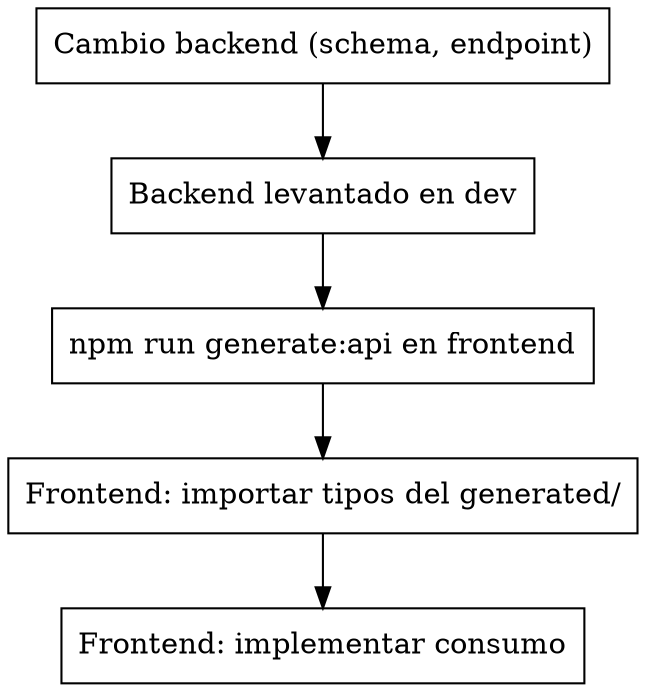

# OpenAPI Frontend Sync

## Overview

Duplicar tipos entre backend y frontend a mano es un trabajo
tedioso y propenso al error que ya no hace falta. Si el backend expone
un OpenAPI schema (FastAPI, NestJS con `@nestjs/swagger`, Django con
drf-spectacular, etc.), un generador puede producir un cliente
tipado para el frontend.

**Principio:** el backend es la única fuente de verdad del contrato.
El cliente del frontend se **genera** desde el OpenAPI schema, nunca
se escribe a mano.

**Anunciar al inicio:** "Aplicando `openapi-frontend-sync` antes de
tocar el cliente de API en frontend."

## Step 1: Confirmar que el backend expone OpenAPI

Verificar antes:

```bash
# FastAPI default
curl http://localhost:8000/openapi.json | jq '.info'

# NestJS con @nestjs/swagger
curl http://localhost:3000/api-json | jq '.info'

# Django + drf-spectacular
curl http://localhost:8000/api/schema/ | jq '.info'

# Spring Boot + springdoc
curl http://localhost:8080/v3/api-docs | jq '.info'
```

Si el endpoint responde con un JSON OpenAPI válido (versión 3.0+),
sigue. Si no, esta skill no aplica — primero hay que activar OpenAPI
en backend.

## Step 2: Elegir y configurar el generador

Generadores comunes para frontend:

| Generador | Stack frontend | Output |
|---|---|---|
| `openapi-typescript` | TS puro | Tipos solo (no client) |
| `openapi-typescript-codegen` | TS | Cliente axios + tipos |
| `openapi-fetch` | TS | Client fetch-based con tipos |
| `orval` | TS / React Query | Tipos + hooks de React Query |
| `@hey-api/openapi-ts` | TS | Cliente moderno (sucesor de openapi-typescript-codegen) |
| `swagger-codegen` / `openapi-generator` | Multi-stack | Genérico, pesado |

Setup mínimo en `package.json`:

```json
{
  "scripts": {
    "generate:api": "openapi-ts -i http://localhost:8000/openapi.json -o src/lib/api/generated",
    "generate:api:clean": "rm -rf src/lib/api/generated && npm run generate:api"
  }
}
```

Reglas:
- Output a una carpeta clara (`src/lib/api/generated/`).
- Esa carpeta es **read-only** para humanos.
- Comando reproducible — no manual.

## Step 3: Workflow de cambios — siempre backend primero



Razón: si haces el frontend primero, vas a inventar shapes que el
backend no necesariamente produce. Backend primero garantiza que el
tipo es real.

## Step 4: Usar los tipos generados, no redeclarar

```typescript
// ❌ Mal — tipo a mano que duplica el generado
type User = {
  id: string;
  email: string;
  nombre: string;
};

// ✅ Bien — importar el tipo generado
import type { User } from '@/lib/api/generated/types';
// O si el generador exporta por endpoint:
import type { GetUsersResponse } from '@/lib/api/generated';
```

Si el tipo generado tiene un nombre raro (a veces sale
`paths['/users']['get']['responses']['200']`), crear un alias en un
archivo específico:

```typescript
// src/lib/api/types.ts
import type { components } from './generated/openapi';
export type User = components['schemas']['UserResponse'];
export type CreateUserDto = components['schemas']['UserCreate'];
```

Importar desde acá en lugar del archivo generado directo. Esto da un
punto único de adaptación si el generador cambia.

## Step 5: Nunca editar archivos en `generated/`

Los archivos generados se sobreescriben en cada `npm run generate:api`.
Cualquier edición manual se pierde. Si necesitas:

- **Wrapping**: crear un archivo en `src/lib/api/` (no en `generated/`)
  que importe y envuelva.
- **Tipos derivados**: crear un archivo de tipos que extienda los
  generados.
- **Defaults**: configurar el generador, no editar la salida.

Agregar a `.gitignore` solo si el generated se versiona implícitamente
con CI. Si se commitea (más común), dejarlo trackeado pero con un
comentario claro:

```typescript
/* eslint-disable */
// AUTOGENERATED — DO NOT EDIT
// Run `npm run generate:api` to regenerate.
```

## Step 6: Cross-repo (backend y frontend separados)

Si el backend vive en otro repo, hay tres patrones:

| Patrón | Cuándo |
|---|---|
| Backend genera + publica el `openapi.json` como artifact (S3, CDN) | Equipos separados, despliegues independientes |
| Frontend incluye backend como submódulo/clone para generar local | Setup simple, monorepo informal |
| Backend publica un paquete npm con tipos (ej. `@org/api-types`) | Producción seria, múltiples consumidores |

Documentar en `CONTRIBUTING.md` del frontend cómo conseguir el
`openapi.json` actualizado.

## Step 7: Verificar la sync con CI

Agregar al CI un job que:

1. Levante el backend.
2. Corra `npm run generate:api`.
3. Verifique que no hay diff vs el `generated/` versionado:

```bash
git diff --exit-code src/lib/api/generated/
```

Si el diff es no-cero, el dev olvidó regenerar. Fallar el build.
Esto previene la deriva silenciosa entre lo declarado en el código
y lo real del backend.

## Quick Reference

| Situación | Acción |
|---|---|
| Backend agregó un endpoint nuevo | `npm run generate:api` antes de tocar frontend |
| Frontend tiene un tipo `interface User { ... }` a mano | Migrar al tipo generado |
| Cambié un schema en backend | Regenerar antes de implementar consumidores |
| El tipo generado tiene nombre complicado | Step 4: crear alias en `lib/api/types.ts` |
| Tengo que editar algo del `generated/` | Step 5: hacerlo afuera (wrapper o config del generador) |
| Backend en otro repo | Step 6: definir patrón de publicación del openapi.json |
| Cambios de schema se desincronizan silenciosamente | Step 7: agregar verificación al CI |

## Common Mistakes

- **Mantener tipos a mano que duplican el backend.** Tarde o
  temprano divergen y el bug es silencioso.
- **Editar archivos del `generated/`.** Se pierden al regenerar.
- **Implementar el frontend antes de regenerar después de un cambio
  backend.** Inventas shapes que no existen.
- **No tener comando reproducible** (`npm run generate:api`). Cada
  dev regenera distinto y con flags distintos.
- **Versionar el generated/ pero no validarlo en CI.** Termina
  desactualizado y nadie se entera.

## Red Flags

**Nunca:**
- Escribir tipos a mano que duplican el contrato del backend.
- Editar archivos dentro de la carpeta `generated/`.
- Implementar el consumo en frontend sin regenerar después de un
  cambio en backend.
- Asumir que el `openapi.json` está sincronizado sin verificar.

**Siempre:**
- Hacer el cambio en backend primero, regenerar, después tocar
  frontend.
- Importar tipos desde `generated/` (directo o vía alias), no
  redeclarar.
- Tener `npm run generate:api` y `npm run generate:api:clean` como
  comandos reproducibles.
- Validar la sync con CI si los archivos generados se versionan.
